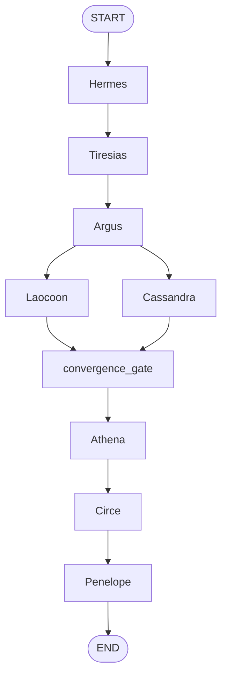

# Agentic orchestration (Odysseus)

DeepGuard runs compliance work as a **directed multi-agent pipeline** orchestrated by the **Odysseus Engine** (LangGraph). Agents are **named roles** (Greek codenames) with **typed contracts**; they do **not** call each other directly. This page summarizes **design intent**, **communication paths**, and how **central orchestration** (the graph topology plus the **convergence gate**) controls **when** downstream agents run and **what quality bar** upstream outputs must meet.

!!! note "Normative detail"
    The authoritative specification is **`Architecture_Design.md`** at the repository root (especially §3 *Agentic Reasoning*, §4 *LangGraph*, §5 *Inter-Agent Communication*, §14 *State Management*). The **`deepguard_graph`** package implements the **L5 graph shell** with **stub nodes** today; full LLM/tool behaviour lands per **`IMPLEMENTATION_PLAN.md`** phases.

---

## 1. Agent roles (registry)

Each agent is a **LangGraph node** (or a subgraph) with a fixed responsibility. The product registry:

| Codename | Role (short) |
|----------|----------------|
| **Hermes** | Ingestion gateway — clone/stage repo, cloud snapshots |
| **Tiresias** | Policy parser — controls from policy artefacts |
| **Argus** | Code indexer — AST, dependency graph, embeddings |
| **Laocoon** | IaC analyser — infrastructure-as-code branch |
| **Cassandra** | Cloud config agent — read-only cloud branch |
| **Athena** | Compliance mapper — cross-layer reasoning |
| **Circe** | Remediation advisor — patches / guidance |
| **Penelope** | Report assembler — PDF and artefacts |

Supporting names in the architecture (**Aeolus** queue bus, **Calypso** secrets, **Eumaeus** auth) sit **outside** the core scan DAG but feed the same **ScanState** / event contracts.

---

## 2. Graph topology (central orchestration)

The orchestrator is the **compiled LangGraph** `StateGraph`: it decides **order**, **parallelism**, **skips**, and **joins**. Execution order for v0 is fixed:

**Hermes → Tiresias → Argus → (Laocoon ∥ Cassandra) → convergence_gate → Athena → Circe → Penelope**

**Conditional fan-out** after Argus (see **`packages/graph/src/deepguard_graph/graph.py`**) uses **`Send`** so Laocoon and/or Cassandra run **in parallel** when `scan_layers` selects IaC and/or cloud. **Skip** nodes exist when a branch is not needed so the graph never blocks waiting for a branch that was never scheduled.

---

## 3. How agents are designed

### 3.1 Structured ReAct (per agent)

Architecture §3.1 defines a **Structured ReAct** loop per agent node (not open-ended chat):

1. **OBSERVE** — read typed fields from shared state (`ScanState` / `OdysseusState`).
2. **THINK** — chain-of-thought over structured context.
3. **PLAN** — emit a validated **`ToolCallPlan`** (Pydantic).
4. **ACT** — deterministic **ToolNode** runs tools (clone, query, index, …).
5. **VERIFY** — agent checks tool output for coherence before accepting it.
6. **EMIT** — write **partial state updates** back into the graph state.

Constraints that matter for quality:

- **Typed inputs/outputs** (Pydantic) reduce format drift and injection risk.
- **Bounded loops** (max iterations, guards on `confidence_score` / `loop_count`).
- **Post-verify confidence** (§3.2): agents can emit **`confidence_score`**, **`should_escalate`**, and structured **`AgentOutput`** so orchestration can **pause or escalate** (e.g. **interrupt before Athena** when human review is required — Architecture §4.7).

### 3.2 What the code does today

**`deepguard_graph`** builds **`build_odysseus_graph()`** with **stub nodes** (`stub_hermes`, …, `stub_convergence_gate`, …) that append to **`execution_log`** and **`stub_findings`** to prove **ordering**, **fan-out**, **fan-in**, and **checkpoint** behaviour. Replacing stubs with real **`HermesAgent`**, … implementations is the phased work tracked in **EPIC-DG-01** and related epics.

---

## 4. Inter-agent communication

Agents **never** invoke each other’s Python entrypoints directly. All cross-agent data flows through:

| Channel | Use |
|---------|-----|
| **`ScanState` (TypedDict)** | Synchronous merge of **partial returns** from each node; reducers (e.g. `Annotated[..., operator.add]`) combine lists and logs. |
| **Aeolus (queue / streams)** | Async work, heartbeats, long-running subtasks — Architecture §5.1 / §30. |
| **Object store + `ArtifactRef`** | Large blobs (indexes, PDFs): state carries **references** (bucket, key, checksum), not multi-megabyte payloads — §5.3. |

**`AgentMessage`** (Architecture §5.2) is the schema for bus messages: `sender`, `recipient`, `msg_type`, typed `payload`, `trace_id` for observability.

**Athena’s inputs** are explicitly the **union** of index + branch findings + policy controls (§5.4 table): the design assumes **Laocoon** and **Cassandra** have finished (or explicitly skipped) **before** Athena runs — enforced structurally by the **convergence gate** edge, not by Athena pulling from agents ad hoc.

---

## 5. Convergence gate: quality before the next phase

The **convergence_gate** is the **central join** after parallel analysis. It is not a separate “LLM supervisor” in the stub implementation, but in the **target architecture** it:

- **Waits** for both parallel branches to reach the join (LangGraph **fan-in**), or for **skip markers** when IaC or cloud is disabled — §4.5.
- **Validates** that required **completion markers / artefact refs** exist so Athena does not start on **empty or partial** branch outputs — EPIC-DG-01 AC ties this to Architecture §4.5–4.6.
- Acts as the **quality choke point** between **parallel evidence gathering** and **downstream reasoning** (Athena): only **merged, schema-valid state** proceeds.

Upstream **per-agent VERIFY + confidence** (§3.2) complements this: severe uncertainty can set **`should_escalate`** so the **compiled graph** can **interrupt before Athena** (§4.7) — another orchestration-level quality gate **before** kicking off the heavy compliance-mapping phase.

**Stub today:** `stub_convergence_gate` only records that the node ran; production logic will implement reducers / predicates described in **`Architecture_Design.md`**.

---

## 6. End-to-end flow (operator view)

1. **API / worker** receives **`CreateScanRequest`** → job enqueued → worker invokes graph with **`thread_id = scan_id`**.
2. **Hermes** stages inputs; **Tiresias** loads controls; **Argus** indexes code.
3. **Laocoon** and/or **Cassandra** run according to **`scan_layers`**.
4. **convergence_gate** ensures join conditions before **Athena**.
5. **Athena → Circe → Penelope** consume consolidated findings and emit report references.
6. **Checkpoints** after nodes allow **resume** after failure (§4.6).

---

## 7. Related reading (repository)

| Document | Topic |
|----------|--------|
| `Architecture_Design.md` §3–§5, §14 | Reasoning loop, graph, messaging, state |
| `IMPLEMENTATION_PLAN.md` | Phase ↔ EPIC rollout |
| `docs/user-stories/EPIC-01-scan-job-orchestration.md` | Backlog ACs for graph behaviour |
| `packages/graph/src/deepguard_graph/graph.py` | Current graph wiring |
| `packages/graph/src/deepguard_graph/state.py` | Minimal `OdysseusState` for L5 |
