# Agents, purposes, and state behaviour

This page describes each **named agent** in the DeepGuard compliance pipeline: its **purpose**, the **meaning of its states** (design intent and how the v0 LangGraph shell models them), a **state diagram** with transitions, and **how reaching a state affects downstream agents**. It complements [Agentic orchestration](agentic-orchestration.md) (topology and messaging) and the normative **`Architecture_Design.md`** at the repository root (full contracts).

!!! note "Implementation status (v0)"
    **`deepguard_graph`** runs **stub nodes** for most graph steps (see `stub_nodes.py`). **Hermes** has a **real ingestion** path in **`deepguard_agents`** used from the worker before the graph runs. State diagrams below describe the **intended lifecycle** each node will expose when fully implemented; today many transitions collapse into a **single graph step** (stub `EXECUTE → DONE`).

---

## Full agent transition flow (entire pipeline)

This is the **end-to-end transition diagram** between agents as wired in **`build_odysseus_graph()`** (`packages/graph/src/deepguard_graph/graph.py`): **ingestion subgraph** (Hermes → Tiresias → Argus), **conditional parallel `Send`** after Argus, **fan-in** at **convergence_gate**, then **Athena → Circe → Penelope** to **END**.

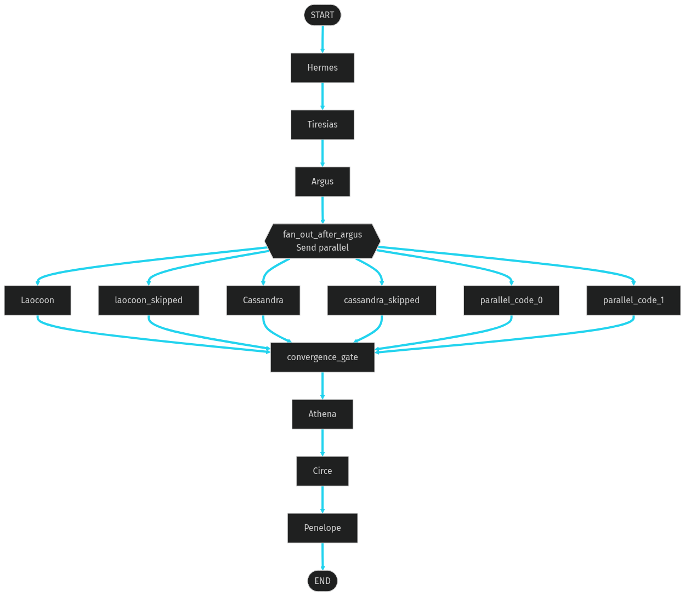

| Artefact | Path |
|----------|------|
| **PNG (diagram used above)** | [`images/odysseus-full-agent-flow.png`](images/odysseus-full-agent-flow.png) (MkDocs / `documentation/images/` in repo) |
| **Mermaid source (edit + regenerate)** | [`diagrams/odysseus-full-agent-flow.mmd`](diagrams/odysseus-full-agent-flow.mmd) (MkDocs / `documentation/diagrams/` in repo) |
| **Regenerate script** | `scripts/render_documentation_diagrams.sh` (repository root) |

The same structure appears as Mermaid inline in [Agentic orchestration — §2](agentic-orchestration.md#2-graph-topology-central-orchestration); the PNG is the **canonical wide export** for slides and print.

---

## Full pipeline with per-agent substates (detailed)

The diagram below is a **single combined view**: each **rounded box (subgraph)** is one LangGraph node (or branch) with its **internal execution substates** on the left-to-right / top-to-bottom paths. Titles use **Name — short functionality** (e.g. **Hermes — Ingestion gateway**). **Happy-path** edges are emphasised in cyan; **FAILED** / **REVIEW** paths are shown inside the owning agent so you can see where errors or HITL attach without redrawing the whole spine.

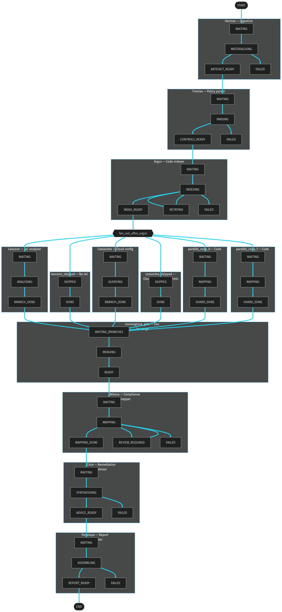

| Artefact | Path |
|----------|------|
| **PNG (detailed diagram)** | [`images/odysseus-agent-flow-with-substates.png`](images/odysseus-agent-flow-with-substates.png) |
| **Mermaid source** | [`diagrams/odysseus-agent-flow-with-substates.mmd`](diagrams/odysseus-agent-flow-with-substates.mmd) |

**How to read it:** follow **START → Hermes → … → END** along **ARTEFACT_READY → … → INDEX_READY → fan_out → … → BRANCH_DONE / DONE → convergence READY → MAPPING_DONE → ADVICE_READY → REPORT_READY**. **fan_out_after_argus** fans to **six** possible targets (only the branches selected for this scan run in code); all completed branches feed **WAITING_BRANCHES** on **convergence_gate**.

---

## 1. Pipeline vs scan row lifecycle

The **control plane** exposes coarse **scan lifecycle** values (`ScanLifecycleStatus` in `deepguard_core`). They describe **where the job is in the product**, not every internal agent micro-state.

| State | Meaning | Typical agent / phase |
|-------|---------|------------------------|
| **PENDING** | Scan accepted but not yet durable / not queued | Pre-queue |
| **QUEUED** | Job message may be published to Redis; worker can claim | Before worker claims |
| **INGESTING** | Worker claimed; Hermes-style materialisation may run | Hermes (+ row stage) |
| **INDEXING** | Code / assets indexed for analysis | Argus (when separated from INGESTING in product) |
| **ANALYZING** | Parallel branches (IaC / cloud / code shards) | Laocoon, Cassandra, shards |
| **MAPPING** | Compliance mapping | Athena |
| **REMEDIATING** | Remediation synthesis | Circe |
| **REPORTING** | Report / PDF assembly | Penelope |
| **AWAITING_REVIEW** | HITL gate (e.g. LangGraph `interrupt_before` Athena) | Human + resume |
| **COMPLETE** | Terminal success | — |
| **FAILED** | Terminal error | — |
| **CANCELLED** | Cooperative cancel | — |

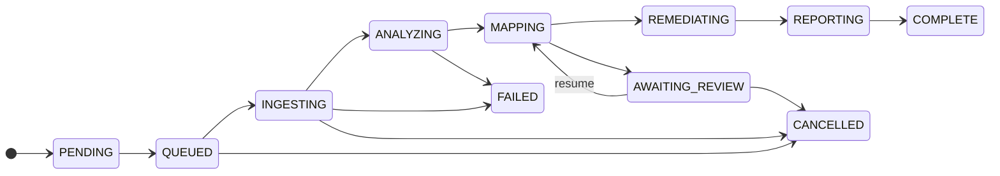

**Effect on agents:** downstream LangGraph nodes only run after the worker has advanced the scan and the **compiled graph** reaches the corresponding topological position (e.g. **Athena** after **convergence_gate** completes).

---

## 2. Odysseus (orchestrator)

**Purpose:** LangGraph **StateGraph** — schedules nodes, **fan-out / fan-in**, **checkpoints**, optional **interrupts**, and **retries** (e.g. Argus). Agents do not call each other; Odysseus passes **partial state updates** along edges.

| State | Meaning |
|-------|---------|
| **NOT_STARTED** | Graph not invoked for this `thread_id` (`scan_id`) |
| **STREAMING** | `stream` / `invoke` in progress |
| **INTERRUPTED** | HITL pause before a configured node (e.g. Athena); checkpoint saved |
| **COMPLETED** | Graph reached `END` |
| **FAILED** | Uncaught exception; scan row may move to `FAILED` |

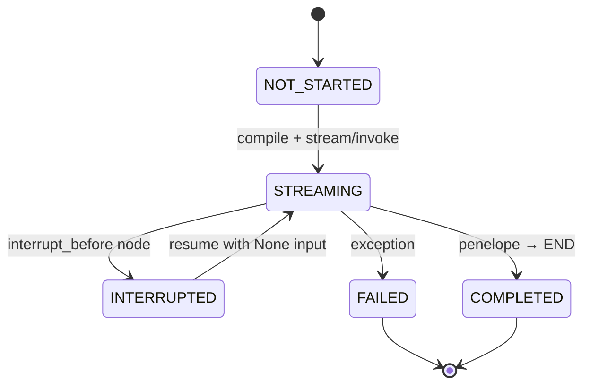

**Effect on other agents:** only **one** branch of the graph runs at a time per checkpoint thread, except where **`Send`** schedules **parallel** nodes (Laocoon ∥ Cassandra ∥ optional code shards). **All scheduled parallel branches** must reach **convergence_gate** before **Athena** runs.

---

## 3. Ingestion subgraph (Hermes → Tiresias → Argus)

These three run as a **compiled subgraph** `ingestion`: fixed order **Hermes → Tiresias → Argus** (`graph.py`).

### 3.1 Hermes (ingestion gateway)

**Purpose:** Move repositories, archives, and related artefacts into the analysis sandbox; surface **repo context** (commit SHA, paths) into `job_config` / state.

| State | Meaning |
|-------|---------|
| **WAITING** | Subgraph entered; inputs from `OdysseusState` |
| **MATERIALISING** | Clone / extract / S3 staging (real path: `hermes_ingest`) |
| **ARTEFACT_READY** | Ingest outputs merged into state / `job_config` |
| **FAILED** | Size limits, clone errors, sandbox violations |

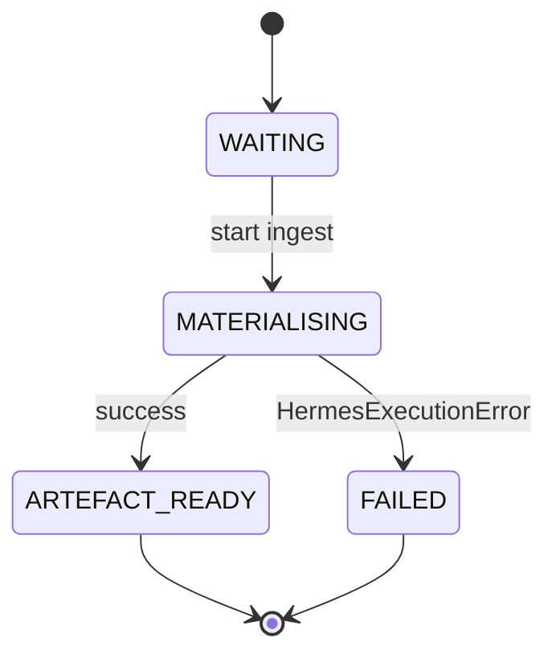

**Triggers:** **Tiresias** starts only after Hermes completes successfully inside the subgraph (edge `hermes → tiresias`). Worker may run Hermes **before** the graph when configuring the scan row (`job_executor`); graph stub Hermes still runs for ordering in v0 stubs.

### 3.2 Tiresias (policy interpretation)

**Purpose:** Resolve policy artefacts into **typed controls** and excerpts attached to state (library: `deepguard_policies`).

| State | Meaning |
|-------|---------|
| **WAITING** | Waits for Hermes outputs / policy refs in state |
| **PARSING** | Load YAML/PDF paths; extract controls |
| **CONTROLS_READY** | Structured controls available to Argus / Athena |
| **FAILED** | Parse / schema errors |

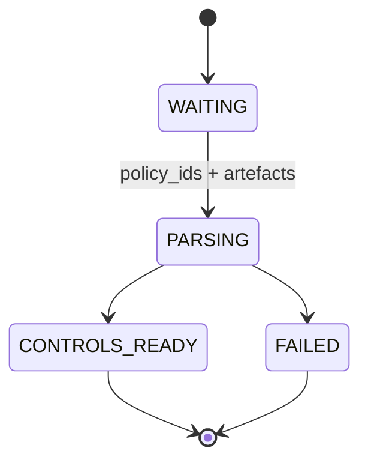

**Triggers:** **Argus** runs after Tiresias (`tiresias → argus`). Downstream **Athena** consumes policy context indirectly via shared state after indexing and analysis branches.

### 3.3 Argus (code indexer)

**Purpose:** Build **code intelligence** (AST, dependency graph, embeddings) for code-layer controls.

| State | Meaning |
|-------|---------|
| **WAITING** | Waits for repo + policy context |
| **INDEXING** | Indexing / embedding work |
| **INDEX_READY** | Index artefacts available in state |
| **RETRYING** | LangGraph **RetryPolicy** on transient failures |
| **FAILED** | Non-recoverable index errors |

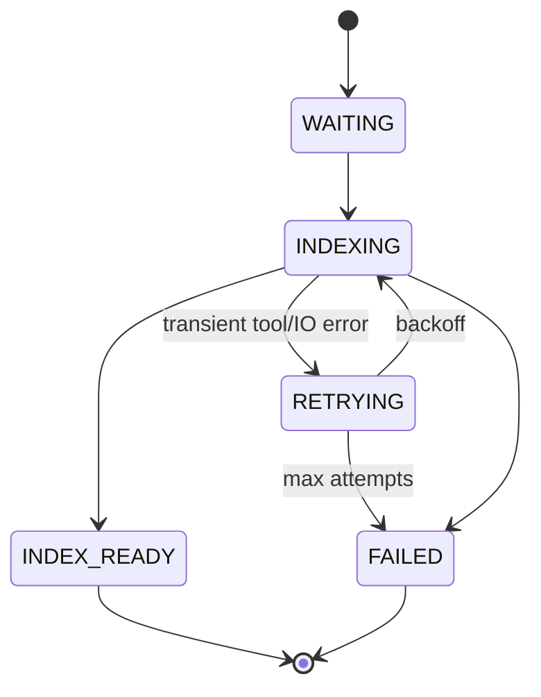

**Triggers:** When Argus completes, the parent graph runs **`fan_out_after_argus`**, which emits **`Send`** to **Laocoon** and/or **Cassandra** and optional **parallel_code** shards. **No downstream agent** in that fan-out runs until Argus has finished.

---

## 4. Parallel analysis branches

### 4.1 Laocoon (IaC) vs Laocoon_skipped

**Purpose:** Analyse infrastructure-as-code for misconfigurations and Trojan-horse patterns.

| State | Meaning |
|-------|---------|
| **SKIPPED** | `scan_layers.iac` is false — **skip node** runs instead of Laocoon |
| **WAITING** | Branch scheduled |
| **ANALYSING** | IaC tools on staged templates |
| **BRANCH_DONE** | Partial findings merged toward convergence |

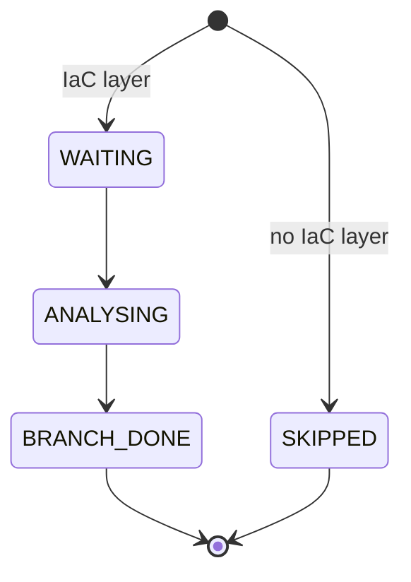

**Triggers:** **convergence_gate** waits for **all** fan-out targets that were scheduled (including **laocoon_skipped**). Skipped is a **first-class node** so the join never deadlocks.

### 4.2 Cassandra (cloud) vs Cassandra_skipped

**Purpose:** Read-only cloud posture checks when snapshots/config are present.

| State | Meaning |
|-------|---------|
| **SKIPPED** | Cloud layer off or no `cloud_snapshots` |
| **WAITING** | Branch scheduled |
| **QUERYING** | Connector calls (rate-limited) |
| **BRANCH_DONE** | Findings / evidence refs in state |

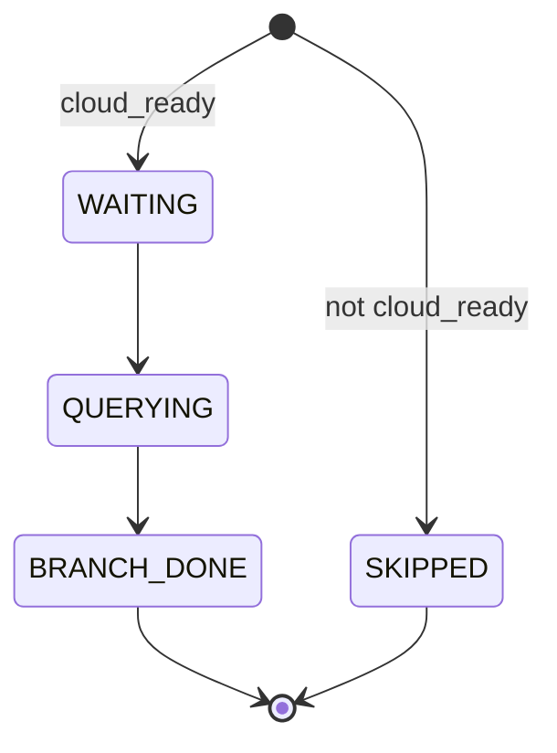

**Triggers:** Same as Laocoon — **convergence_gate** after **all** parallel branches complete.

### 4.3 Parallel code shards (`parallel_code_0` / `parallel_code_1`)

**Purpose:** Optional **map** work (e.g. per-directory) after Argus when `job_config.langgraph.code_analysis_shard_keys` is set.

| State | Meaning |
|-------|---------|
| **IDLE** | Not scheduled (no shard keys) |
| **MAPPING** | Mapper stub / future mapper |
| **SHARD_DONE** | Labelled partial result in `execution_log` |

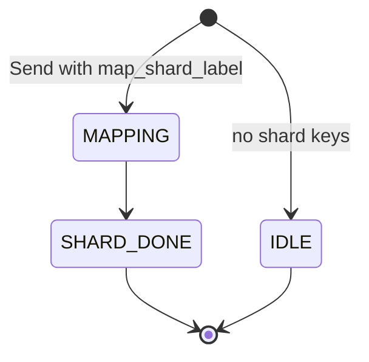

**Triggers:** Each scheduled shard runs **before** convergence; **Athena** sees merged state only after **convergence_gate**.

---

## 5. Convergence gate

**Purpose:** **Fan-in** — merge parallel branch outputs, enforce **quality / completeness** bar before compliance mapping.

| State | Meaning |
|-------|---------|
| **WAITING_BRANCHES** | Not all predecessors finished |
| **MERGING** | Combine partial states / ordering |
| **READY** | Downstream **Athena** may start |

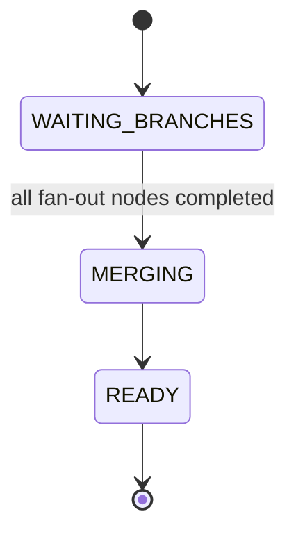

**Triggers:** **Athena** edge is `convergence_gate → athena` only after this node completes.

---

## 6. Athena (compliance mapper)

**Purpose:** Map evidence to controls; generator + critic patterns; may request **human review**.

| State | Meaning |
|-------|---------|
| **WAITING** | Inputs from convergence |
| **MAPPING** | LLM / rules batch mapping |
| **REVIEW_REQUIRED** | Low confidence or policy HITL (`interrupt_before_athena` path) |
| **MAPPING_DONE** | Findings ready for Circe |
| **FAILED** | Mapping errors |

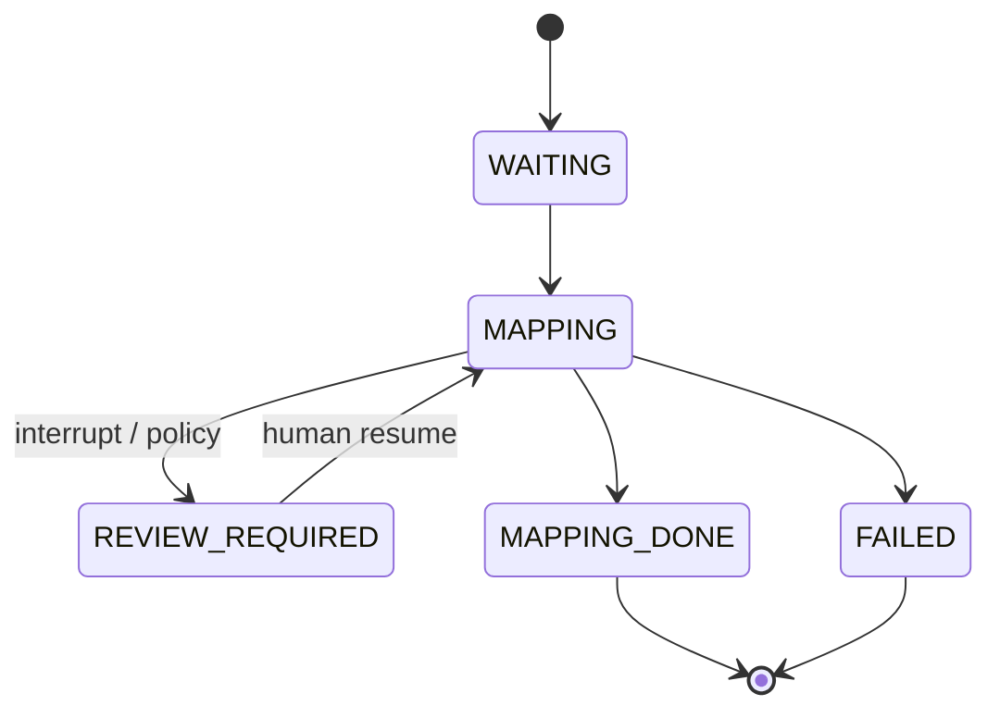

**Triggers:** **Circe** runs only after Athena completes successfully without pausing at end, or after resume completes the node.

---

## 7. Circe (remediation advisor)

**Purpose:** Propose **non-auto-applied** remediations (diffs, IaC edits, runbooks).

| State | Meaning |
|-------|---------|
| **WAITING** | Needs Athena findings |
| **SYNTHESISING** | Generate remediation options |
| **ADVICE_READY** | Patches / guidance in state |
| **FAILED** | Tool / model errors |

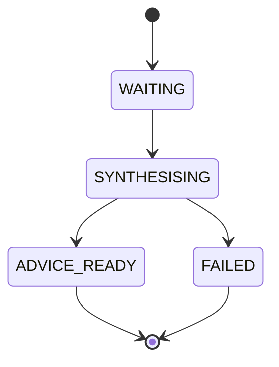

**Triggers:** **Penelope** consumes remediation + findings for the report.

---

## 8. Penelope (report assembler)

**Purpose:** Assemble **PDF** (and other artefacts) into object storage.

| State | Meaning |
|-------|---------|
| **WAITING** | Inputs from Circe + findings |
| **ASSEMBLING** | Layout, charts, integrity hashes |
| **REPORT_READY** | PDF bytes / URI written; scan can go **COMPLETE** |
| **FAILED** | Layout / IO errors |

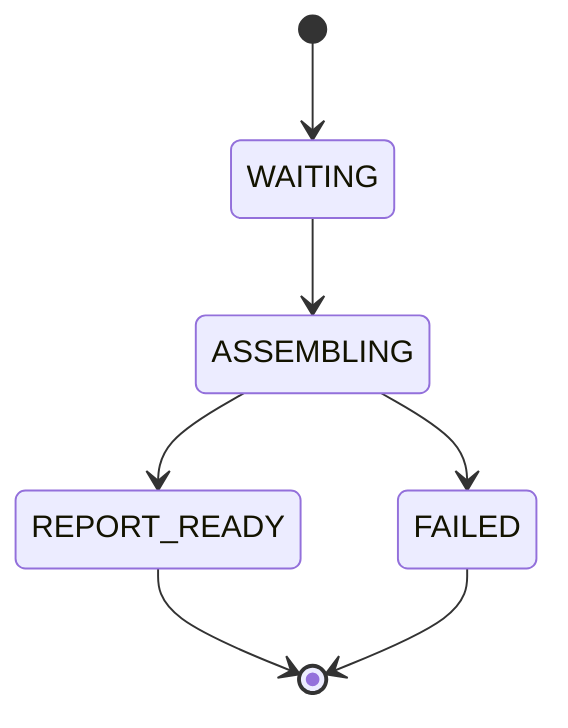

**Triggers:** Graph **END**; worker marks scan **COMPLETE** with report artifact when this phase succeeds in the product path.

---

## 9. Cross-agent trigger summary

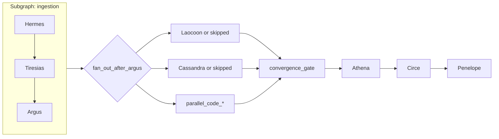

**Rules of thumb**

1. **Subgraph order is strict:** Hermes → Tiresias → Argus.
2. **Fan-out is data-driven:** `scan_layers` and `cloud_snapshots` choose real vs skip nodes; skip nodes still **run** to satisfy the join.
3. **Fan-in is blocking:** Athena never starts until **every** selected parallel predecessor has finished **and** convergence_gate has run.
4. **HITL** surfaces as **scan `AWAITING_REVIEW`** and a paused checkpoint until resume; Circe and Penelope do not run until Athena’s barrier is cleared per graph configuration.

---

## 10. Code map (study order)

| Topic | Path |
|-------|------|
| Graph topology & `Send` | `packages/graph/src/deepguard_graph/graph.py` |
| Stub node behaviour | `packages/graph/src/deepguard_graph/stub_nodes.py` |
| Shared graph state | `packages/graph/src/deepguard_graph/state.py` |
| Hermes ingest (worker) | `packages/agents/src/deepguard_agents/hermes_ingest.py` |
| Policy parse (Tiresias domain) | `packages/policies/src/deepguard_policies/parse.py` |
| Penelope PDF | `packages/reporting/src/deepguard_reporting/penelope_pdf.py` |
| LangChain / Athena experiments | `packages/agents/src/deepguard_agents/lc_chains.py`, `athena_fake.py` |

---

## See also

- [Agentic orchestration](agentic-orchestration.md) — topology, Structured ReAct, convergence.
- [LangGraph / LangChain / observability](langstack-usage-and-roadmap.md) — checkpoints, tracing, workflow API.
- [Architecture](architecture.md) — system intent and pointers to **`Architecture_Design.md`**.
